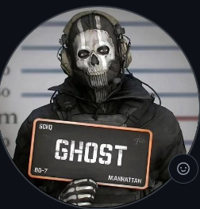
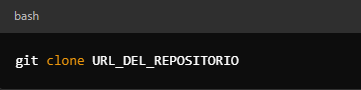
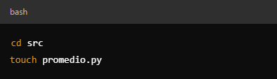
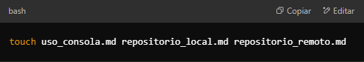

# Bitacora Mateo Ardila 
Este proyecto es un ejercicio para aprender a usar Git y GitHub organizando correctamente un proyecto.
 

## Estructura del proyecto 

# Puedes acceder al siguiente contenido de la bitácora:
### **Procesos realizados en la creacion de la bitacora**

### *Acceder al directorio del repositorio clonado:*

### *crear la estrcutura del proyecto*

### *creaccion de un codigo de fuente*

### *Como realizar un commit*

### *crear una carpeta de docs/ y agregar:*

### *subir los cambios al repositorio remoto*

### *crear un archivo readme que indique el contenido de la bitacora*

### *Edicion de un archivo y creaccion de su contenido*

### *como añadir imagnes*

## 📂 Tabla de contenido 

Puedes acceder al siguiente contenido de la bitácora:  
- Carpeta de documentos
    [📜Repositorio local](../docs/repositorio_local.md)
    [📜 Repositorio remoto](../docs/repositorio_remoto.md)
    [📜 Uso de consola](../docs/uso_consola.md)
- Carpeta de **src**
    [📌 Carpeta de src](../src/)
- Carpeta de Imgenes
    [⚡Imagenes](../imagens)

