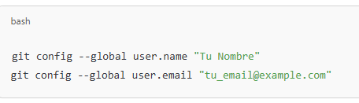
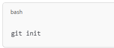
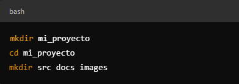
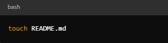
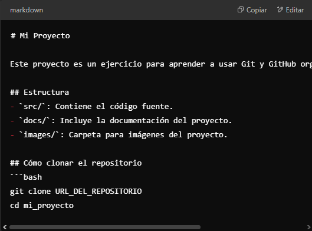
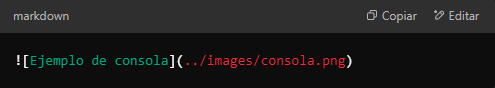
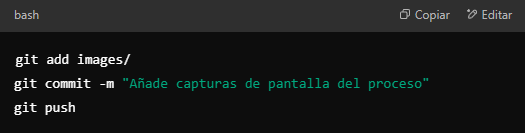

# Creación de un Repositorio Local con Git

### Configurar git 

### Inicializar el repositorio

### crear la estrcutura del proyecto

### Crear un archivo readme que indique el contenido de la bitacora

### Edición de un archivo y creacción de su contenido

### Como añadir imagnes

### Subir los cambios al repositorio remoto

