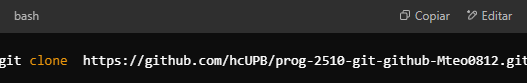
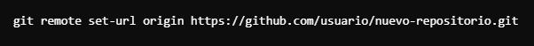
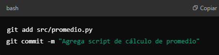

# Repositorio remoto 
Usos y comandos basicos para la creacion de un repositorio remoto de git 

## Vincular un Repositorio Local con un Remoto
Despues de crear un repositorio en GitHub, GitLab o Bitbucket, vincúlalo con:

## Clonar un repositorio remoto 

## Control de ramas del repositorio 

## Cambio de URL de repositorio remoto 

## Descargar cambios del repositorio remoto

## Subir los cambios al repositorio remoto 

