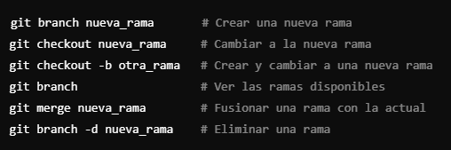

# Uso de la Consola

## Comandos básicos:
- `pwd`: Muestra la ruta del directorio actual.
- `ls`: Lista los archivos y carpetas del directorio actual.
- `cd nombre_directorio`: Cambia al directorio especificado.
- `mkdir nombre_directorio`: Crea un nuevo directorio.
- `touch nombre_archivo`: Crea un nuevo archivo vacío.

## Conectar repositorios remotos 
Comandos de ejemplo de como crear y enlazar un repositorio local con un repositorio remoto 

## Como realizar un commit en git bash

